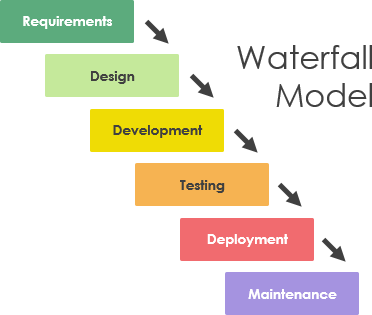

# BDD
- Behavior Driven Development
- User Story 
    - a feature written perspective of a certain kind of user
    - As a, I want to, so that
- User stories are used to design the application
    - It prevents over designing the applicaiton
        - writing features no one wanted
    - Prioritize features
    - Not forgetting or overlooking key aspects of the feature
        - easy to forget that a certain field might needed to submit a form
- Acceptance Criteria
    - Detailed steps that a user would perform to fulfill a user story
    - Acceptance Criteria could be written in anything but Gherkin syntax is the most popular
- Business Rules
    - Very high level requested features
        - example we want a feature that allows employees to request PTO
- Business Analyst
    - Not necessarilly a tech person (some technical experience)
    - Main job is to commuincate with the clients and dev team to create user stories and acceptance

# Cucumber/Gherkin/Behave
- Gherkin 
    - NOT a programming language 
    - Writing acceptance criteria
    - Key Syntax
        - Feature
            - High level Description of the feature user story
        - Background
            - Keyword that you can use to define steps that run before each scenario
            - If you had a feature that required someone to be logged in you could have a backgroud that had all the steps to log in
        - Scenario
            - More specific description of a user story
        - Scenario Outline
            - Scenario that has been paramaterized with examples
        - Examples
            - example inputs for the Scenario Outline
        - Given
            - Some state of the application or User
                - User is logged in
                - User is on the home page
                - User has a pending request
        - When 
            - Some action that the user performs (should contain action verb)
                - The user clicks on something
        - Then
            - Some verification of something (should have a should)
                - The user should see a pop up
                - The page should conatain the requested info    
        - And 
            - not fundamentally different than  a Given, When or Then
        - Or
            - not fundamentally different than  a Given, When or Then
- Cucumber
    - Originally a Ruby testing framework for matching Ruby tests to gherkin feature files
    - Very popular and people wrote version for Java and JS
- Behave
    - Essentially the Python version of Cucumber
        - Techninally not part of the official Cucumber software

### General Process for Automated tests
1. Write the Feature files with the associated acceptance criteria
2. you have to write Step implementations for each unique acceptance criteria
    - most frameworks will auto generate these method stubs
    - a step implemention is the actual code for making that AC a reality
    ```python
    @when("The Guest types into the search bar") # acceptance criteria
    def type_into_search_bar(): # step implementation
        home_page.search_bar().send_keys("Hello")
    ```
3. Run the feature files
    - look over the test results

# Selenium
- It is not a testing framework
- It automates web pages that is all it does
- The selenium software has been written for all major programming languages
- Selenium is chocolate and Cucumber is peanut butter
    - They have nothing to do with each other but work great together

## Web Driver
- Web Driver is the main object in Selenium
- Every action that selenium does is performed by the web driver
- Every browser needs its own specific web driver
```python
    # creates a web driver
    driver = webdriver.Chrome('C:\\Users\\AdamRanieri\\Desktop\\drivers\\chromedriver.exe')
```
## Selectors
- Getting web elements is one of the most important parts of Selenium
- There are several ways to do it
    - by ID
    - by Name
    - by CSS class
    - by CSS selector 
        - allows you to target specific attributes on an element
    - by xpath (try to avoid xpath if possible. Unreliable)
        - Relative xpath is the 'relative' directions to an element
        - Absoulate xpath is starting from the root html element direction to the element
    ```python
    element: WebElement = self.driver.find_element_by_id("js-link-box-en")
    element: WebElement = self.driver.find_element_by_css_selector('div[lang="es"]')
    element: WebElement = self.driver.find_element_by_xpath('//*[@id="www-wikipedia-org"]/div[2]/div[8]')
    element: WebElement = self.driver.find_element_by_xpath('html/body/div[2]/div[8]')
    element: WebElement = self.driver.find_element_by_name("search")
    element: WebElement = self.driver.find_element_by_class_name("pure-button-primary-progressive")
    ```

## Waits
- Often an element is not available immediately
- We need to tell the driver to wait for it to become available
- ways to wait
    - halt execution of the program
        - literally put the thread to sleep
        - VERY BAD AVOID
    - Implicit wait
        - set once on the driver
        - default amount of time the driver will wait for any element to appear before throwing an error and giving up
    - Explicit wait
        - set for a specific element
        - amount of time the driver will wait for that specific element to appear before throwing an error and giving up
    - Fluent Wait
        - Set up polling on an element
        - retry getting the element every 5 seconds

### POM
- Page Object Model
- Common design pattern for selenium
- Create a class that contains the core web elements of the web page
- Create an instance of this class to write you code in a more fluid less redundant way
```python

class WikiHomePage:

    def __init__(self, driver: WebDriver):
        self.driver = driver #Dependency injection of a driver into the web page

    def english(self):
        element: WebElement = self.driver.find_element_by_id("js-link-box-en") # get element by 
        return element

    def spanish(self):
        element: WebElement = self.driver.find_element_by_css_selector('div[lang="es"]')
        return element

    def italian(self):
        element: WebElement = self.driver.find_element_by_xpath('//*[@id="www-wikipedia-org"]/div[2]/div[8]')
        return element

    def search_bar(self):
        element: WebElement = self.driver.find_element_by_name("search")
        return  element

    def search_button(self):
        element: WebElement = self.driver.find_element_by_class_name("pure-button-primary-progressive")
        return  element
```
## Testing Terminology

- Happy Path Testing
    - writing a test assuming everything will work correctly and the user puts in valid information
- Alternate path testing   
    - writing a test assuming that wrong information is passed in or there is a failure somewhere else in the code
- White Box Testing
    - Writing a test where you can see the code being tested.
        - unit test or integration test
        - You can visibly see the code that you test
- Black Box Testing
    - Writing a test where the implementation code is not being observed
    - Concerned that the results are what you want
    - For example a Selenium Script that logs in someone is a black box test of the server
        - You might have 0 idea how the server works
        - You might not even know what language it is written in
- Unit Test (White Box)
    - An atomic test
    - A test the checks functionality of a SINGLE FUNCTION 
    - That function SHOULD NOT rely on outside functionality
    - A service test that uses mocked dependency is a unit test
- Integration Test (White Box sometimes called Gray box if some of the code is not viewable)
    - A composite test
    - A test that requires multiple pieces of functionality to work correctly to pass
    - A serivce test that is not mocked requires a DAO that works
    - A function that has to call other other functions that you have written
- End to End Test E2E (usually black obx)
    - Test an application as an end user
    - They require the ENTIRE feature to be working in order for the test to pass
    - Create a book on my web page and see that the book is given an ID and added to my view all books table.
        - The front-end and the back-end had to be working
- Automated Test
    - Any test executed by a machine
    - Often used in reference to selenium
    - But applies to any testing framework
        - JUnit
        - pytest
    - goal as a developer is to automate everything you can
- Manual Test
    - A test performed directly by a human

# SDLC
- Software Development Lifecycle
- There is not perfect official SDLC workflow
    - you will see different terminolgies
    - number steps
    - Some combine steps
1. Requirements
    - Initial of creating software
    - What does the application need to do?
        - User stories
    - What are the priorities of this application?
        - Usability
        - Speed
        - Reliabilty
        - looks amazing
2. Design
    - Create the interfaces of the application
    - Front-end 
        - UI for actual humans
    - Back-end and general architecture
        - What language are we using for our server?
        - What endpoints are there? 
        - What do our entities look like?
        - What services we might need?
3. Development/Testing
    - Implementation
    - Actually writing code and tests to verify that your code workd
4. Deployement
    - Packaging your software in a way that your clients can use it
        - Web Application might be deployed to AWS
            - Setting up web servers
            - Setting up production databases
        - Desktop App might be burned into CDs
5. Maitenence/monitoring
    - Monitoring the in production application
        - Viewing the amount of traffic it gets
        - Reviewing the logs generated by the application
        - Any comments or messages sent by client
            - reports bugs/ requested features etc....
### Waterfall Methodology
- Waterfall is the old school approach to building software applications
- You only go DOWN the waterfall NEVER back up
- Rigid and contract based
    - If you realize some interface is poorly design.... too bad
    - You are NOT going to go back and redesign it


### Agile
- Agile is the more modern approach
- It is a mindset
- Agile is NOT a specifc practice or set of processes
    - implementations of agile are
        - Scrum
        - Kanban
- Agile manifesto (core tenets)
    - Individuals and interactions over processes and tools
        - One of waterfall's biggest problem was red tape and team hierarchy preventing bewteen communicating succesffully to solve problem.
        - Horizontal vs vertical teams
    - Working software over comprehensive documentation
        - Waterfall had a HEAVY emphasis on documentation
            - SRS really explicit technial documents
        - Working demos explain progess and how the applicaiton is supposed to work way better than the best written docuemention in the world.
    - Customer collaboration over contract negotiation
        - Waterfall would generate a litigous SRS document with inflexible requirements
        - Clients do not really know what they want. They emphasize the wrong things
        - Better to have weekly updates with the client with demos
    - Responding to change over following a plan
        - be AGILE and willing to adapt to the project
        - Software Engineering is very flexible and editable compared to other fields
            - If a bridge engineer designs the concrete foundation in a non optimal way
                - He cannot ctl + Z
        - You can go back and redisgn make upates