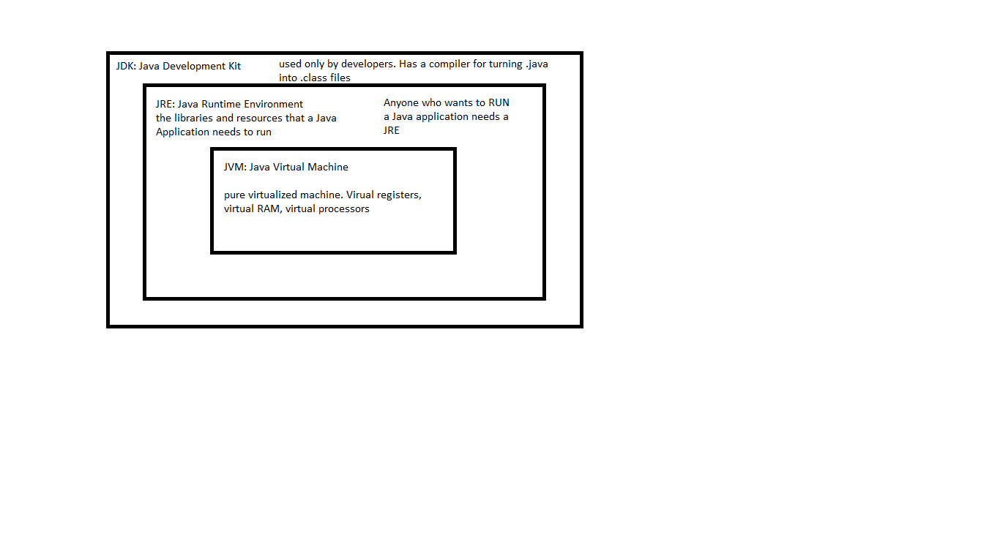
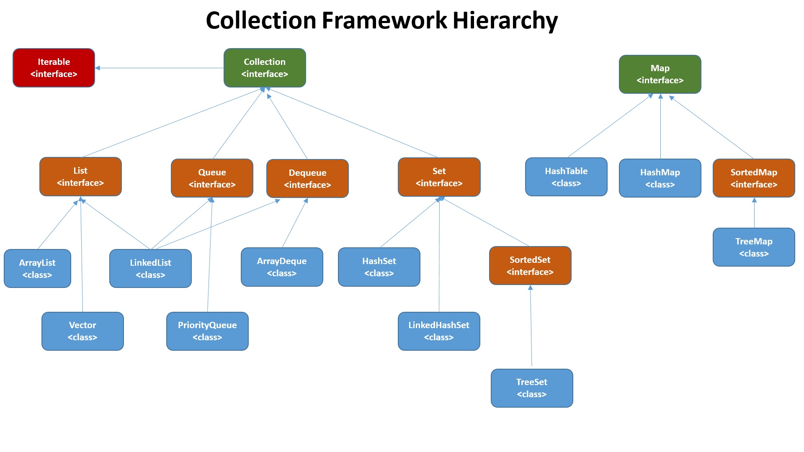

# Java Review

## Core Features of Java
- Highly OOP Language
    - Designed for scalabilty and enterprise software
- High Level Language
    - Automatic Memory management
    - Garbage Collector that removes objects that are no longer used/reachable in the program
    - Stack
        - The current methods being executed in your application
        - Whenever a method is called it gets put on the stack executes then is popped off the stack
        - Any operations performed involving only the stack are very fast
    - Heap
        - All objects in Java live in the Heap
        - Memory for everything in Java
- Strongly Typed
    - Java will not implicity change the type of variables in your code
- Statically Typed
    - All variables must have a type when declared
    - All methods must have a return type specificed
    ```java
    int x = 100;

    double add(double num1, double num2)
    ```
- Compiled Language
    - The entire source code is read and then turned into Java Byte Code
        - Source Code is human readable and is in **.java** files
        - Java Byte Code is not for humans. Instructions for the JVM to execute the program **.class** files
- WORA (Write Once Run Anywhere)
    - Once your code has been compiled into .class files that application can be run on ANY machine that has a JVM


## OOP (Object Oriented Programming)
- Paradigm (way of apporaching software) where applications are built around objects
- Class
    - blueprint for an object
- Object
    - instance of class
    - Objects can have state and behavior
        - State
            - fields
        - Behavior
            - methods
### Pillars of OOP (APIE)
- Abstraction
    - Hide Implementation
    - We can interface and use objects without knowing the code or exactly how they work
    - You can code to a List interface and not know anything about how an implentation of list works
- Polymorphism
    - One object many labels
        - A Reward Card is also A credit card
        - You can interact with the same object in different ways
    - Static Polymorphism **Overloading**
        - Same method name but different parameters
        ```java
        
        double add(double num1, double num 2){/**code */};

        double add(String s1, String s2){/**code */};
        ```
    - Runtime Polymorphism **Overriding**
        - The same method signature but with a different implementation in the child class
        ```java
        public class Car{

            void drive(int miles){}
        }

        public class HatchBack extends Car{
            
            @Override
            void drive(int miles){
                // this code is different than the parent
            }
        }
        ```
- Inheritance
    - Ability of one class to inherit or derive state and behavior (fields and methods) from another class
    - DRY (Don't Repeat Yourself) 
        - Your code should never have repated functions
    - creates an Is-A relationship
- Encapsulation
    - Hiding/protecting parts of our code from other areas of our code
    - We want to protect our data from missue or calling methods that we do not want other developers to use
    - Achieved via Access modifers in Java
    - **ACCESS MODIFIERS ARE NOT SCOPES**
        - public
            - Accessible/visible anywhere in the appliaction
        - protected
            - default + any inherited classes
        - (default)
            - Accessible/visible only within the package
        - private
            - Accessible/visible only within the class

## Primitives and Wrappers
- Primitives are the only things in Java that are NOT objects
```java
// primitves
boolean
byte
short
char
int
float
long
double
```
- Wrappers are OBJECT versions of primitives
- They can provide more functionality and primtives than primitives but are less efficient
```java
// Wrappers
Boolean
Byte
Short
Chararcter
Integer
Float
Long
Double
```
- Autoboxing
    - a primitive is turned into a wrapper by Java
- Unboxing 
    - a wrapper is turned into a primitive

## Scopes 
- THERE IS NO GLOBAL SCOPE IN JAVA
- static/class
    - the variable is attached to the class itself
- instance
    - every instance of this class gets its own copy
- method 
    - passed in parameter
- local/block
    - defined within a block in a method
    ```java
    class Person{

        // class variable
        static int counter = 0;

        // instance variable
        String name;

        Person(String name){
            this.name = name;
        }

        //otherPerson is a method scope variable
        // it is available anywhere within the method
        void greetPerson(String otherPerson){

            {
                // block scope variable
                String unused = "I am a local variable";
            }

            System.out.println("Hello" + other person + "my name is " + this.name);
        }
    }
    ```
### Constructors
- A special type of method in Java
- They are the only methods that can be used to create an object
- They MUST be named the same as the class
- They DO NOT have a return type
- Can be overloaded
- CAN'T be overridden
- First line of any constructor is super
- If there are no constructors in a class you get a default no-args constructor

### Abstract Classes and Interfaces
- Abstract classes are just like regular class only cannot be instantiated directly
- Intefraces grant the ability to do so
    - usually end in "able"
        - Comparable 
        - Serializable
        - Iterable

| Abstract Class | Interface |
|----------------|-----------|
|Class that cannot be instantiated| Cannot be instantiated|
|Have instance variables, access modifiers| public static final variables|
|Can have concrete methods| Have only abstract methods|
|Inherit one abstract class| Implement as many interfaces as you want|

- Types of Interfaces
    - FunctionalInterface
        - An interface with only one method
        - A template to build lambdas
    - Marker Interface
        - An interface with NO methods in it
        - Used to give a class a type. Useful for some classification and OOP structres

### Collections API/Framework
- Is a group of interfaces and implementation classes
- A "collection" is an object that is designed to store other objects
    - Lists
    - Sets
    - Queues
    - Maps (Not a real collection. It does not implement the Collection interface)
- Iterable is the top collections framework
    - Maps do not implement it and are not iterable as result
- Most collections implement the Collection interface
- Interfaces to know
    - List
        - Maintains the order of insertion
        - Allows duplicates
        - Implementations of List
            - ArrayList
            - LinkedList
    - Set
        - Do not maintain the order of insertion
        - Do not allow duplicates
        - Implementations of Set
            - TreeSet (orderd via a comprable interface)
            - HashSet (essentially unorderd)
    - Queue (deprecated in favor of Dequeue)
        - Stores elements in a First-In First-Out (FIFO)
        - Implemenatations
            - LinkedList
    - Map
        - Stores Objects as Key Value pairs
        - Not iterable
        - Implementations
            - HashMap (99%)
            - Hashtable (Hilariously does not follow Java namin conventions)
            - TreeMap (A map that stores the values in order. Which I have never found a good reson to use)


### Exceptions and Errors

- Exception is an object that carries information about what went wrong in a program
- Two Types of exceptions
    - Unchecked Exceptions (Runtime Exceptions)
        - Exceptions which are **OPTIONAL** to catch and handle
        - Examples
            - IndexOutOfBounds
            - NullPointer
            - ArithmeticException
            - Anything that inherits from RuntimeException
    - Checked Exceptions (Compile time Exceptions)
        - Exceptions that are **REQUIRED** to catch and handle
            - Your code will not compile unless you have code to handle these exceptions
        - Examples
            - FileIO
            - SqlException
            - Anything that inherits from Excpetion
- try
    - block of code that might generate an exception
- catch
    - "catch" handle any thrown exceptions
    - Must be ordered from most specific to most general excpetion
- finally
    - The block of code that ALWAYS executes at the end
    - Whether there is an exception or not
- throw 
    - used to generate or send flying an excpetion in the program
    - synonymous to Raise in Python
- throws
    - Put a on a method to signature
    - Warns that this method MIGHT generate a certain exception
    ```java
    void writeTestResultsToFile() throws IOException{

    }
    ```
- Errors
    - Catastrophic failures that you should not try to catch but are catchable
    - Examples
        - OutOfMemoryError
        - StackOverflowError

### Lambdas
- Add functional programming to Java
- Standalone function objects not tied as methods to a class
- steps to create your own lambdas
    1. Create a functional interface
    ```java
    @FunctionalInterface
    interface Calculate {
        double calc(double num1, double num2);
    }
    ```
    2. Write an implementation of that interface
    ```java
    Calculate add = (num1, num2) -> {return num1 + num2;};
    ```
    3. If you want to call that function directly
     ```java
    add.calc(10,45);
    ```

### Maven
- Java build tool and Dependendency manager
- Consturcut java applications but add outside 3rd parties libraries to your applicaiton
- Python does not have a dedicated "build tool" like Maven
- Python does have pip for dependency managment and Maven can take on that resposiblity
- pom.xml
    - Project Object Model
    - An xml that contains all the information you could want regarding how to build the project and what dependencies it needs
    - same purpose as a package.json in node.js
- Maven Repsitory
    - A giant collections of Java Libraries
    - Essentially the Java version of PyPi

### String
- AN OBJECT
    - NOT A PRIMTIVE
- String are immutable
    - cannot be altered once created
- Strings of the same value are the same object in memory
    - This is to save on memory
- The location in the heap where strings live is called the String Pool
- StringBuilder
    - Mutable Cousin of String
    - Used for operations involving a lot of character manipulation

### Generics
- <> notation
- Allow you specify what specific type an something will be
- Exists to generate type safety when you know at Runtime what a type is going to be
- Used Extensively in the collections framework

### Object
- Grandfather class of everything in Java
- All objects are of type Object
- Important methods on the Object class
    - toString()
        - returns a string representation of the object
        - by default it return the memory address
    - equals(Object o)
        - returns a boolean if method says so
        - by default checks to see if it is the same memory address
        - == checks memory address bewteen objects
        - equals should be overridden to be a more business logic practical comparison


### final
- final is a keyword with a few uses
- put it in front of a variable to make it constant (unable to be reassigned)
```java
final int x = 100;
``` 
- put it on a method to make it un-overrideable
```java
final void hello(String person);
``` 
- put it in front of a class to make it un-inheritable
    - String class is final
```java
final class Person{}
``` 
- put it in a method sigunature to make the input parameter constant
```java
int add(final int num1, final int num2){}
``` 
