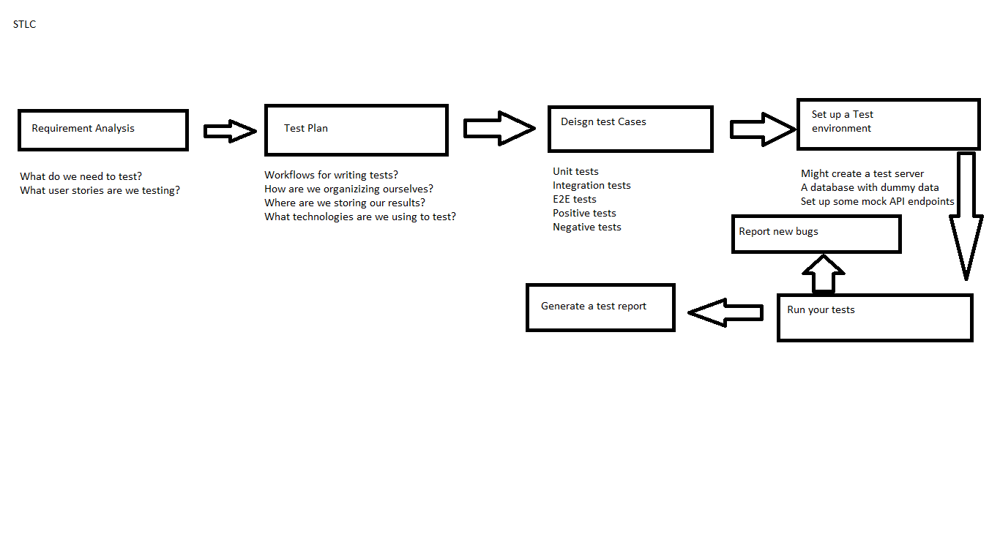
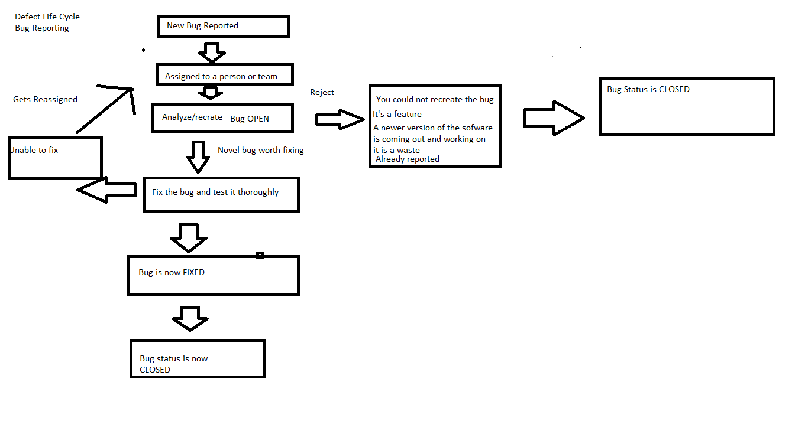

# SDLC

- Ranieri SDLC basics
1. Requirement analysis/planning
    - What are the most important things to get done?
    - Are there any current issues that need to be addressed?
    - What have we learned previously that might help us.
2. Design
    - Technologies
    - Arhcitecture
    - Create teams and workflows
3. Implement
    - Creating the application
4. Testing
    - verify everything workd
5. Deploy
    - make availabe to end users
6. Maitnenece/ Survailence
    - Making sure that the applicaiton has not crashed
    - Are there any problems reported by users.

# STLC
- A life cycle for testing
    - Kind of a sub set of the SDLC
- A lot like the SDLCE

# Defect Lifecycle
